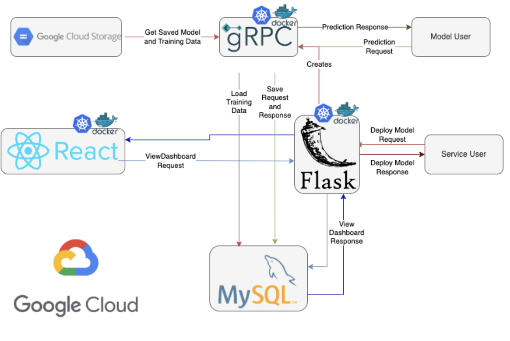

# Simple ML Deployment and Monitoring Platform

#### Introduction
Our application takes a machine learning model and the data on which that model was trained and deploys the model to a public endpoint as well as providing a dashboard so that users can monitor the performance of their models in production. New deployments can be created through a web GUI or through our REST API.

#### Application Architecture

#### Usage
We have provided some test scripts to use the application yourself in the `/testing` directory. If you visit `http://35.193.203.116:5000`, you should see a page the simply has "Models:" at the top. This is because no models are deployed. To deploy a model, run `python3 rest-client.py deploy`, to deploy a model. This will take a few minutes. When it returns, it should give you the public IP address of the server on which the deployed model is running. Copy this and paste it into `grpc-client.py` in the appropriate location and then run that file. This will send a batch request of about 200 examples over to the gRPC server. Once these steps have been taken, head back over to the aforementioned webpage and refresh it. You should see that a new model has been deployed. Click on it to view the statistics comparing the distribution of the training data to that of the production data. These same steps are outlined in the YouTube demo below. 

#### Video Demo
https://youtu.be/LxlvIXBwZMU
